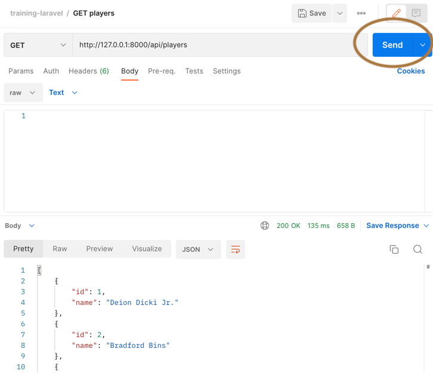

# Laravel研修

## 用意する物
1. (windowsの場合。mac,linuxは不要) wslとubuntu
    * https://www.kkaneko.jp/tools/wsl/wsl2.html
    * ubuntuは最新のバージョン
1. PHP 7.4, composer
   * Windowsの場合
     * https://windows.php.net/download#php-7.4
     * https://getcomposer.org/doc/00-intro.md#using-the-installer
   * Macの場合
     1. brew install php@7.4
     1. brew link php@7.4
     1. brew install composer
1. Docker
    * Dockerをインストールする
    * https://www.docker.com/
1. Postman
   * APIクライアントに使用する
   * https://www.postman.com/downloads/
   * 利用するために、postmanの無料ユーザー登録をする。
1. DBクライアント
   * Windowsの場合
     * HeidiSQL https://www.heidisql.com/download.php
   * Macの場合
     * SequelPro https://sequelpro.com/

## 初期設定
1. (windowsの場合。mac,linuxは不要) wslのubuntuに入って、作業のフォルダを作って、`git clone`
    * ubuntu起動するコマンド: `ubuntu` or `wsl`
    * homeに入る: `cd ~`
    * 作業フォルダを作る `mkdir laravel`
    * `cd laravel`
    * `git clone`
    * vscodeを起動するコマンド: `code .`
1. `.env.example` を `.env`にリネームする
1. `id -u && id -g` コマンドでユーザーIDを確認して、 `.env` ファイルの `DOCKER_UID` と `DOCKER_GID` に同じ値を入れる
1. `docker-compose up`を実行する
1. コンテナの中に入る
    ```
    docker-compose exec app bash
    ```
1. 次のコマンドを実行して依存ライブラリをインストールする
    ```
    composer update
    composer install
    ```
1. MySQL上にplayersテーブルを作成する
    ```
    php artisan migrate --seed
    ```
1. `ctrl + d` を入力して、コンテナからログアウトする。

### 小ワザ
* 既存のテーブルを作り直して、データも同時に投入する。
    * `php artisan migrate:refresh --seed`

## Postmanの初期設定
1. `training-laravel.postman_collection.json` をPostmanにインポートする

## ゲームサーバー起動
```
docker-compose up
```

ゲームサーバーが起動したら、Postmanを起動してsendボタンでゲームサーバーへリクエストを投げてみる。

レスポンスとしてプレイヤー情報が返ってきたらOK。


